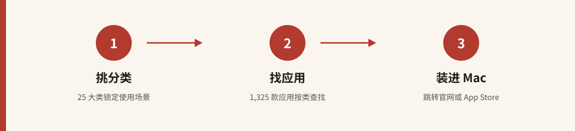

# Awesome Mac · 中文版

**115,000+ ★ 的 macOS 应用大全 —— 为中文用户重新整理的导航版**

[源项目 jaywcjlove/awesome-mac](https://github.com/jaywcjlove/awesome-mac) · [📇 全量应用索引](apps-index.md)

---

## 📌 这是什么

**Awesome Mac · 中文版** 是对知名开源项目
[jaywcjlove/awesome-mac](https://github.com/jaywcjlove/awesome-mac)
的**中文导航与索引**。

源项目由中文社区知名开发者 **jaywcjlove（王超 / 二货开发者）** 维护，
常年位居 GitHub macOS 主题榜单前列，截至 **2026-10-06 已获 115,465 颗星**。
它把优质 macOS 软件按场景系统分类：从文本编辑器、IDE、终端，
到设计工具、影音、效率增强、窗口管理，几乎覆盖一台 Mac 从装机到深度优化的全部需求。

本仓不搬运应用正文，而是为你提供：

- **全部分类的中文译名**与**条目数实测统计**；
- 一张按条目数排序的**高频分类速查表**；
- 指向源 README 对应章节的**锚点直达链接**（见 [apps-index.md](apps-index.md)）。

## 💡 为什么值得收藏

1. **数字真实**：星数、分类数、条目数全部来自 2026-10-06 的 GitHub API 与源 README 实测，不注水。
2. **中文友好**：源 README 以英文为主，本仓把 25 个主分类、42 个子类全部译为中文，找应用不再靠猜英文标题。
3. **场景导航**：按「我想做什么」而不是「应用叫什么」来组织——写代码、剪视频、管密码、清理磁盘，一查即到。
4. **自由开放**：源项目以 **CC0-1.0** 贡献给公共领域，本导航仓以 **MIT** 发布，两者均可自由使用。

## 📊 数据一览

| 指标 | 数值 | 口径 |
| --- | --- | --- |
| 源仓星标 | **115,465** | GitHub API 实测，2026-10-06 |
| 主分类（H2） | **25** | 排除目录与页脚章节 |
| 子类（H3） | **42** | 隶属于主分类下 |
| 收录应用条目 | **1,325** | 源 README 中 `* [应用名](链接)` 列表逐条计数 |

统计方法：下载源 `master` 分支 `README.md`（271,851 字节），
从 `<!--start-->` 标记起逐行解析，`## ` 记为主分类、`### ` 记为子类、
以 `* [` 开头的行记为一条应用；`Contributors`、`License` 等页脚章节不计入。

## 🚀 快速开始

1. **挑分类**：在下表或 [apps-index.md](apps-index.md) 里按中文场景锁定大类；
2. **找应用**：点击分类名跳到源 README 对应章节，查看每个应用的简介与开源 / 免费 / App Store 标记；
3. **装进 Mac**：跟随应用链接前往官网或 App Store 下载。

## 🗂 分类速查（精选 19 个高频分类）

| 中文分类 | 条目数 | 代表应用 |
| --- | --- | --- |
| 实用工具集 Utilities | 408 | Raycast · Alfred · Bartender · Rectangle |
| 开发者工具 Developer Tools | 229 | VS Code · Xcode · Docker · Postman |
| 读写工具 Reading & Writing | 153 | Typora · Obsidian · Bear · Notion |
| 设计与产品 Design & Product | 137 | Figma · Sketch · Blender · Pixelmator |
| 音视频工具 Audio & Video | 82 | IINA · VLC · HandBrake · DaVinci |
| 沟通协作 Communication | 55 | 微信 · Telegram · Slack · Lark |
| AI 工具 AI Tools | 50 | ChatGPT · Claude · Cherry Studio |
| 安全工具 Security | 27 | LuLu · KnockKnock · Malwarebytes |
| 代理与 VPN Proxy/VPN | 23 | Surge · ClashX · Mullvad |
| 浏览器 Browsers | 22 | Safari · Arc · Chrome · Orion |
| 语音转文字 Voice-to-Text | 21 | Whisper 系开源听写工具 |
| 终端应用 Terminal Apps | 17 | iTerm2 · Warp · Ghostty |
| 下载管理 Download | 17 | Downie · Motrix · Transmission |
| 翻译工具 Translation | 13 | DeepL · Easydict · iTranslate |
| 游戏软件 Gaming | 12 | OpenEmu · Whisky · PlayCover |
| 远程登录 Remote Login | 12 | RustDesk · TeamViewer · Royal TSX |
| 云存储 Cloud Storage | 7 | Dropbox · NextCloud · ownCloud |
| 输入法 Input Methods | 9 | 青简 · vChewing · InputSourcePro |
| 包管理器 App Markets | 5 | Homebrew · Cork · Applite |

> 完整 25 主分类 / 42 子类清单（含条目数与源锚点链接）见
> [apps-index.md](apps-index.md)。

## ❓ 常见问题

**Q：数据多久更新一次？**
统计快照日期为 2026-10-06。源仓非常活跃（最近一次推送为 2026-10-05），
星数与条目数会自然增长；本仓数字会在每次同步时重新实测，不写死。

**Q：为什么不把 1,325 条全部搬过来？**
本仓定位是**中文导航与索引**，而非源仓的镜像。完整应用简介、图标标注与下载链接
均在源 README 中持续维护，直接跳转可以保证你看到的永远是最新版本。

**Q：这些应用收费吗？**
源 README 用统一图标标注每条的属性：开源（OSS）、免费 / 个人免费（Freeware）、
App Store 链接、原生应用等。本导航不改变任何应用的授权性质，请以官网为准。

**Q：可以来贡献吗？**
应用条目的增删请直接向源仓提 PR（CC0 许可，欢迎贡献）；
如果你想优化中文译名、补充分类说明，也欢迎在本仓开 Issue 或 PR。

**Q：条目数 1,325 是怎么数出来的？**
见上方「数据一览」的统计方法说明——从源 README 正文起点逐行计数列表项，
不含目录、不含贡献者与许可页脚。

## 🤝 参与贡献

- 应用数据贡献 → [jaywcjlove/awesome-mac · Contributing](https://github.com/jaywcjlove/awesome-mac/blob/master/docs/CONTRIBUTING.md)
- 本导航仓改进 → 直接在本仓开 Issue / PR

## 🙏 致谢

诚挚感谢 **[jaywcjlove](https://github.com/jaywcjlove)** 与数百位贡献者，
把 1,300+ 款 macOS 软件整理成这份高质量清单，并以 CC0 释放给所有人。
本仓所有荣光归于源社区。

## 📜 许可声明

- **本仓（awesome-mac-zh）**：以 [MIT 许可证](LICENSE) 发布，Copyright (c) 2026 zieang88888。
- **源项目（jaywcjlove/awesome-mac）**：以 **CC0-1.0** 贡献至公共领域；
  详见 [THIRD_PARTY_NOTICES.md](THIRD_PARTY_NOTICES.md) 与[源仓 LICENSE](https://github.com/jaywcjlove/awesome-mac/blob/master/LICENSE)。

[⬆ 返回顶部](#awesome-mac--中文版)
